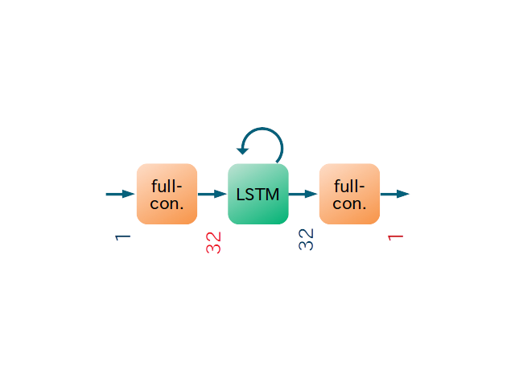

# DLRepertoire02
more deep learning repertoire #2

# Data
```
def make_sin_data(data_per_cycle=200, n_cycle=5, train_ratio=0.8):
    np.random.seed(0)

    n_data = n_cycle * data_per_cycle
    theta = np.linspace(0., n_cycle * (2. * np.pi), num=n_data)

    X = np.sin(theta) + 0.1 * (2. * np.random.rand(n_data) - 1.)
    X /= np.std(X)
    X = X.astype(np.float32)

    n_train = int(n_data * train_ratio)
    X_train, X_test = X[:n_train], X[n_train:]

    return X_train, X_test
```

# Network Architecture


